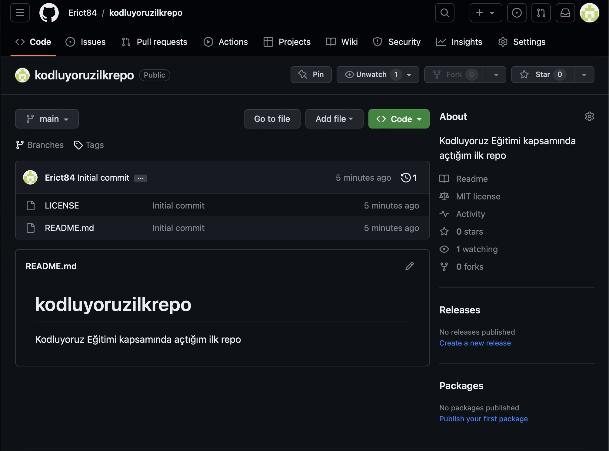

# kodluyoruzilkrepo
Kodluyoruz Eğitimi kapsamında açtığım ilk repo.
Icerisinde bir adet README dosyasi, bir adet de index.html barindiriyor. 


## Installation
Oncelikle projeyi clone'layin (Buraya sizin reponuzdan aldiginiz link gelecek)

```
git clone https://github.com/Erict84/kodluyoruzilkrepo.git
```
## Usage
Projeyi cloneladiktan sonra Visual Studio Code programinda aciniz. 

Linux icin: 

```
cd kodluyoruzilkrepo
code .
```
Mac icin bir markdown editor kullanabilirsiniz. App Store'da ucretsiz yazilimlar bulunmaktadir. Ben [Markdown Editor](https://apps.apple.com/us/app/markdown-editor/id1458220908?mt=12) programini kullaniyorum. 
Veya terminal'den text edit yapabilirsiniz. Daha fazla bilgi icin [Mac'teki Terminal'deki komut satırı metin düzenleyicilerini kullanma](https://support.apple.com/tr-tr/guide/terminal/apdb02f1133-25af-4c65-8976-159609f99817/mac) sayfasini ziyaret edebilirsiniz. 

---
>🔑 **Önemli Not:**
Terminal uzerinden GitHub'a push islemi sirasinda GitHub kullanici adi ve sifre soruyor. Burada asagidaki gibi bir uyari aliyorsaniz, GitHub 2021 yilindan itibaren guvenlik nedeniyle terminal uzerinden sifre ile islem yapilmasina musade etmiyor. Bunun yerine GitHub ayarlarindan bir personal Access Token olusturmaniz ve sifre kismina bunu girmeniz gerekmektedir. 
Daha detayli bilgiye [buradan](https://stackoverflow.com/questions/68775869/message-support-for-password-authentication-was-removed#comment122060858_68775869) ulasabilirsiniz.

```
remote: Support for password authentication was removed on August 13, 2021.
remote: Please see https://docs.github.com/en/get-started/getting-started-with-git/about-remote-repositories#cloning-with-https-urls for information on currently recommended modes of authentication.
fatal: Authentication failed for ....
```
---

## Contributing
Pull requestler kabul edilir. Buyuk degisiklikler icin lutfen once neyi degistirmek istediginizi tartisma konusu acin. 

## License
[MIT](https://choosealicense.com/licenses/mit/)
